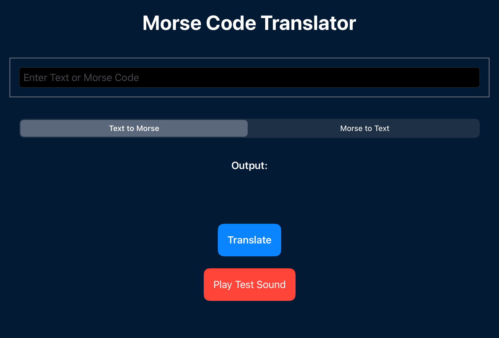

# MorseCodeTranslator

# Morse Code Translator (Swift Playgrounds)

A fun and functional Morse Code Translator app built with **SwiftUI** for **Swift Playgrounds on iPad**. It lets users convert between regular text and Morse code — complete with synchronized **sound effects** and a simple, modern interface.

---

## Features

- Convert **text to Morse code** with sound for dots and dashes
- Convert **Morse code back to readable text**
- Built-in **dot and dash sounds**
- Easy-to-use **UI built with SwiftUI**
- Light blue background for a soft, calming look

---

> ## Screenshot

---

## How It Works

- The app uses two dictionaries to map between characters and Morse code.
- It plays a different sound for `.` (dot) and `-` (dash).
- It uses `AVFoundation` for audio playback.
- Sounds are played **in sync with each Morse symbol** using timed delays.
- The translated Morse code is shown after all sounds are played.

---

## Technologies Used

- SwiftUI
- AVFoundation
- Swift Playgrounds for iPad

---

## How to Run

1. Open Swift Playgrounds on iPad.
2. Import this `.swiftpm` project or copy the code into a new page.
3. Add two `.wav` sound files to **Resources**:
   - `dotSound.wav` (short beep for `.`)
   - `dashSound.wav` (long beep for `-`)
4. Press **Run** to test the translator!

---

## Author

Created by [Haneen] as an individual project for class.
